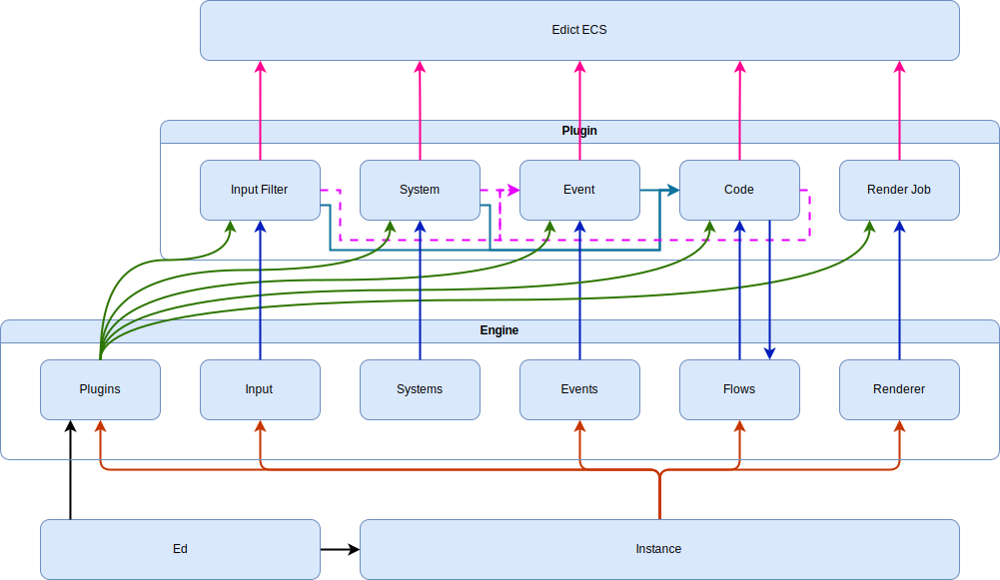

# Arcana Engine

## High Level overview

Arcana is a microengine that provides only fundamental components and the rest
comes from engine plugins.
This way game developer can construct the engine they want reusing existing plugins
and adding game-specific plugins.

Main components of the engine are:
- [`Plugins`] manger

  One of the most important aspect of the engine is the ability to hot-reload plugins.
  Linked plugins export parts for other engine components to use.
  When working in editor plugins can be rebuilt and relinked at will.

  TODO: Last game state would be transferred to new instance.

- [`InputFunnel`]

  External input such as OS events and device input is handled by [`InputFunnel`]
  constructed from [`InputFilter`]s exported from plugins.

  Developer would most likely want to transform raw events into actions using key-binds
  appropriate to specific state. This is the job for particular [`InputFilter`].

- [`System`] is -one of the cornerstores of ECS.

  Systems run periodically in specific order to update simulation.
  Systems are best suited for logic that needs to run in tight loop for many objects.

  In Arcana systems are divided in two categories - variable and fixed rate systems.
  - Variable rate systems run for each frame that will be rendered.\
    This is the best place to update animations, other visuals.

  - Fixed rate systems run with fixed predefined frequency, typically less than frame rate.\
    This is the best place to run periodic game logic that doesn't affect output directly.
    In client-server multiplayer setup nearly all systems on the server will be fixed rate.

  Developer is free to assign any system to any category in the systems schedule.
  Systems in the same category can be ordered to make sure that one runs after another.

- [`Flow`]s are async tasks with access to ECS.

  Being async opens wide range of opportunities.
  Single flow execution can span for the whole game session or even never finish.
  Or they can represent an object lifetime and control its behavior.
  If developer needs to write code that spans for many frames - flows.
  Flows are polled like rust futures (and may be constructed from them).
  Polling happens at variable rate after systems run.
  Flows can be spawned from any code with ECS access.

- [`Event`]s represent occurence of something in the game.

  They are dispatched in order after flows run.
  There are two ways to handle an event. Subscribe and Listen.
  - Subscribers are registered in event dispatcher as callbacks and executed
    immediately when event is pushed there.
    Subscribers can't access ECS so their capabilities are limited.

  - Listeners fetch events when actively polled.
    Typically listeners are polled in systems or flows (can await for next event)
    where received event can be handled freely.

- [`Code`]s provide visual-programming capabilities.

  Developer is able to construct execution graphs using codes exported from plugins.
  Codes are always attached to an [`Entity`].
  When entity has [`Code`] a listener will to poll for events on this entity and dispatch execution starting from event code node.
  [`Code`]s can be async as [`Flow`]s.

- [`Renderer`] uses [`Job`]s exported from plugins.

  Jobs are arranged in work-graph by developer to produce final image.
  [`Renderer`] executes work-graph for each frame and presents it to viewport.

  [`Job`]s uses shared resource manged by work-graph, manages own resources and access ECS
  to fetch data.
  Jobs conceptually only read from ECS
  but are encouraged to cache data associated with [`Entity`]s in ECS
  to reduce amount of work to perform on every frame.

### Components diagram

[`Plugins`]: .
[`InputFunnel`]: .
[`InputFilter`]: .
[`System`]: .
[`Event`]: .
[`Flow`]: .
[`Code`]: .
[`Entity`]: .
[`Renderer`]: .
[`Job`]: .